# LMS Schema Documentation

This repository contains the database schema for a Learning Management System (LMS).

## Database Schema Overview

The LMS database consists of the following main entities:

- **Users & Authentication**: User management, credentials, and profiles
- **Classrooms**: Course management and settings
- **Assignments & Submissions**: Assignment creation and student submissions
- **Grading**: Grade management and categories
- **Communication**: Posts, comments, and notifications
- **Files & Resources**: File management and storage
- **Activity Tracking**: Participation and activity logs

## Entity Relationship Diagram

## Table Definitions

### Core Tables

#### Users

- **Purpose**: Main user entity for all system users
- **Key Fields**: `id`, `role` (admin/teacher/student), `status`
- **Relationships**: Connected to all user-specific tables

#### Classrooms

- **Purpose**: Represents courses/classes in the system
- **Key Fields**: `id`, `teacher_id`, `name`, `code`, `subject`
- **Relationships**: Central hub connecting students, assignments, and posts

#### Assignments

- **Purpose**: Course assignments, quizzes, materials, and projects
- **Key Fields**: `id`, `classroom_id`, `title`, `assignment_type`, `due_date`
- **Relationships**: Links to submissions and grades

### Supporting Tables

#### User Management

- `user_credentials`: Authentication data
- `profiles`: Personal information
- `notification_preferences`: User notification settings

#### Classroom Management

- `classroom_students`: Student enrollment tracking
- `classroom_settings`: Class-specific configurations
- `grade_categories`: Grading category definitions

#### Content & Communication

- `classroom_posts`: Announcements and discussions
- `post_comments`: Comments on posts
- `post_likes`: Post engagement tracking
- `classroom_files`: File storage and management

#### Assessment & Tracking

- `submissions`: Student assignment submissions
- `grades`: Grade records and feedback
- `participation_records`: Attendance and participation
- `activity_logs`: System activity tracking
- `notifications`: System notifications

## Key Relationships

### One-to-One Relationships

- `users` ↔ `user_credentials`
- `users` ↔ `profiles`
- `users` ↔ `notification_preferences`
- `classrooms` ↔ `classroom_settings`

### One-to-Many Relationships

- `users` → `classrooms` (teacher relationship)
- `classrooms` → `assignments`
- `assignments` → `submissions`
- `classroom_posts` → `post_comments`
- `users` → `activity_logs`

### Many-to-Many Relationships

- `users` ↔ `classrooms` (through `classroom_students`)
- `users` ↔ `posts` (through `post_likes`)

## Database Features

### Security & Privacy

- Separate credential storage
- Activity logging
- Role-based access control

### Flexibility

- JSON fields for extensible data
- Configurable grading scales
- Multiple assignment types

### Performance

- Indexed foreign keys
- Unique constraints where appropriate
- Optimized for common queries

## Schema Updates

This schema is automatically updated when changes are made to the diagram files. The CI/CD pipeline:

1. Monitors changes to `.mmd` files
2. Generates updated SVG diagrams
3. Updates this README with the latest schema
4. Commits changes automatically

## Development

To modify the schema:

1. Edit the `diagram/schema.mmd` file
2. Push changes to trigger automatic diagram generation
3. Review the updated documentation

---

_Last updated: Automatically generated by GitHub Actions_
